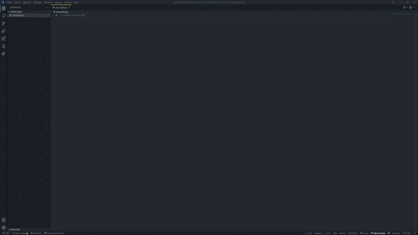

# VSCopilot


VSCopilot is an extension aimed at facilitating developers, while waiting to have access to Github Copilot.

# Usage

## How to use it ?

Two way : 
 - With the command :
    ```
    Ctrl + Shift + P (Windows/Linux) or CMD + Shift + P (Mac) -> Open VSCopilot
    ```
    

 - With the button :
    ```
    Press the VSCopilot button
    ```    
     

## Release Notes

 - Increase numbers of requests

## To Do

 - Add function analyze

### 0.0.2

 - Added more requests (now 5k)
 - System of translate (Support 13 speak languages)

### 0.0.1

 - Work with JS, TS, Go and Python
 - Nom you can use button in StatusBar to do the search
 - Only for comments


## Remerciements

Thanks to Trax and Symbiosis for their help. This project would not exist without them!


-----------------------------------------------------------------------------------------------------------

## Made with ❤️ and ☕ by Imprevisible