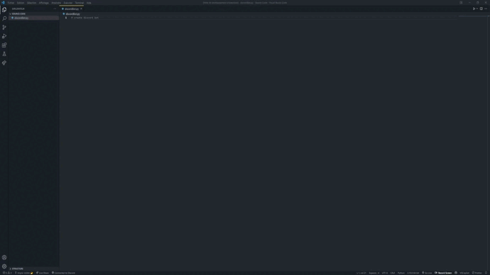

# VSCopilot


VSCopilot is an extension aimed at facilitating developers, while waiting to have access to Github Copilot.

# Usage

## How to use it ?

Two way : 
 - With the command :
    ```
    Ctrl + Shift + P (Windows/Linux) or CMD + Shift + P (Mac) -> Open VSCopilot
    ```
    

 - With the button :
    ```
    Press the VSCopilot button
    ```    
    


## Known Issues

 - You have to press two times the VSCopilot button, or the command

## Release Notes

 - Only 150 requests every day
 - Nom you can use button in StatusBar to do the search
 - Only for comments

## To Do

 - Add function analyze
 - Increase number of requests

### 0.0.1

Work with JS, TS, Go and Python


-----------------------------------------------------------------------------------------------------------

## Made with ❤️ and ☕ by Imprevisible